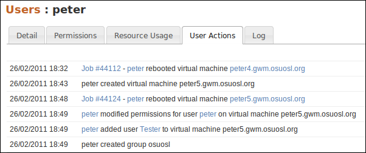

Welcome to Django Object Log's documentation!
=============================================

This app provides the ability to log user actions on model instances.  Action
types can be defined by app developers, and can reference multiple objects.
Each action type defines it's own template used for rendering output of the
message.  It allows verbose messages specific to the action that occurred.

Contents
--------

.. toctree::
   :maxdepth: 2

   installation
   screenshots
   usage
   changelog

Indices and tables
==================

* :ref:`genindex`
* :ref:`modindex`
* :ref:`search`

